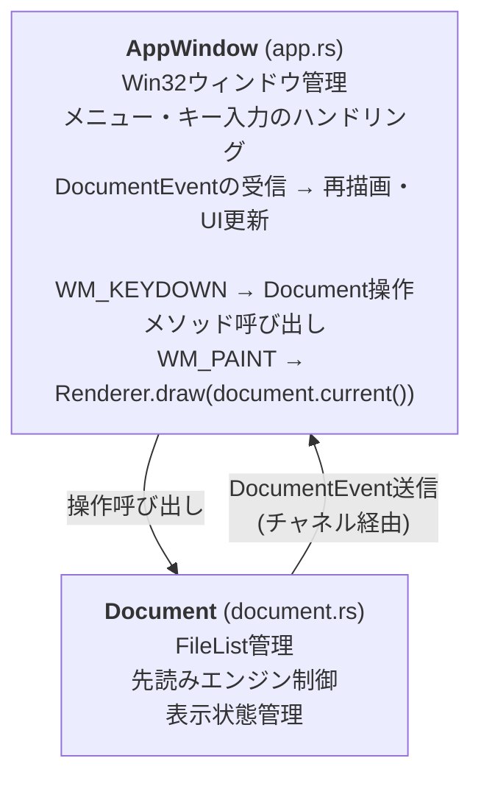
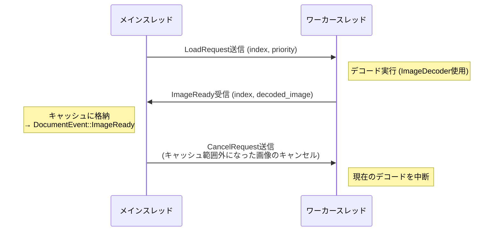

# アーキテクチャ

## 技術スタック

- Rust 2024 edition
- Win32 API (Direct2D, Shell, WIC)
- `crossbeam-channel` によるスレッド間通信

## アーキテクチャパターン: Model-View (MV) 分離

Win32メッセージベースのアプリケーションにはMVVMは過剰であるため、シンプルなMV分離を採用。
Rustのチャネルで疎結合化している。



## 先読みエンジン設計

### リングバッファキャッシュ

```text
     ← 後方キャッシュ  現在  前方キャッシュ →
     [...] [...] [...] [表示中] [...] [...] [...]
      -3    -2    -1     0      +1    +2    +3
```

- キャッシュサイズ（前方N枚 + 後方M枚）は利用可能メモリに基づいて動的に決定
- ベースサイズ（デフォルト1024×1536）の画像を基準にキャッシュ可能枚数を計算
- メモリ予算方式を採用: 固定枚数ではなく、利用可能メモリから動的にキャッシュ枚数を算出することで、
  大画像でもOOM (Out of Memory) を回避

### ワーカースレッド



- `crossbeam-channel` でリクエストキューを実装
- 優先度付きロード: 現在ページ → 次ページ → 前ページ → 遠いページ
- ナビゲーション時に不要なリクエストをキャンセル（世代管理: リクエスト送信時の世代番号と
  現在の世代番号が一致しない場合、レスポンスを破棄）

### 背景コンテナ展開スレッドのI/O優先度制御

多数のZIPをまとめて開くと、残りのコンテナはPendingContainerとしてリストに並び、
バックグラウンド専用のrayonプールで順次展開される。
このプールには以下の制約を入れている。

- 並列度は1に固定する。HDD環境ではシーク競合が支配的であり、並列展開するとむしろディスク帯域を
  食い潰してフォアグラウンド操作（先読みワーカー、メインスレッドのキャッシュミスフォールバック）が
  遅延する。SSD環境でも1並列で十分高速であるため、両者の最大公約数として1を選ぶ。
- ワーカースレッド起動時に `SetThreadPriority(GetCurrentThread(), THREAD_MODE_BACKGROUND_BEGIN)` を呼び、
  I/O優先度とページ優先度をLowに落とす。これにより、同じ物理ディスクに対するメインスレッド・
  先読みワーカーのI/Oが優先される。HDD環境で顕著に効く。
- 世代ごとのキャンセルフラグ（`Arc<AtomicBool>`）で旧rayonプールを停止できるようにしている。
  旧世代を破棄する全経路から共通メソッド`cancel_expansion`を呼び、旧ジョブの残存I/Oを
  進行中の1件だけに抑えている。対象経路は`open_containers`/`open_multiple`/
  `expand_all_pending_sync`/`reschedule_background_expansion`の4つ。

## デコーダチェーン

デコーダはDecoderChainに登録された順で`can_decode()`を試行し、最初に対応したデコーダがデコードを担当する。
登録順は以下の通り。

1. StandardDecoder (`image` crate) — JPEG/PNG/GIF/BMP/WebP
2. SusieDecoder (`libloading`) — Susieプラグインからの動的登録

標準デコーダを優先することで、Susieプラグインがなくても主要フォーマットを確実にサポートする。

## 設計上の制約・選択

- GIFは静止画のみ: アニメーションGIF対応は先読みキャッシュとの整合が複雑になるため意図的に除外
- 削除操作はごみ箱経由: ユーザーの誤操作によるデータ喪失を防ぐ安全設計
- 永続フィルタ: 通常のフィルタが現在の画像にのみ適用されるのに対し、永続フィルタは
  ナビゲーションしても全画像に自動適用される。一括処理（例: 全画像をグレースケールで閲覧）のための仕組み
